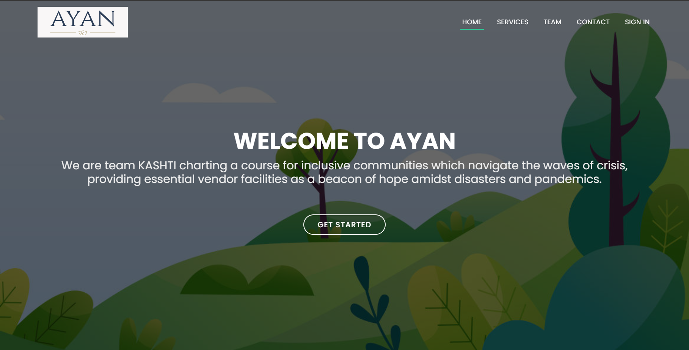
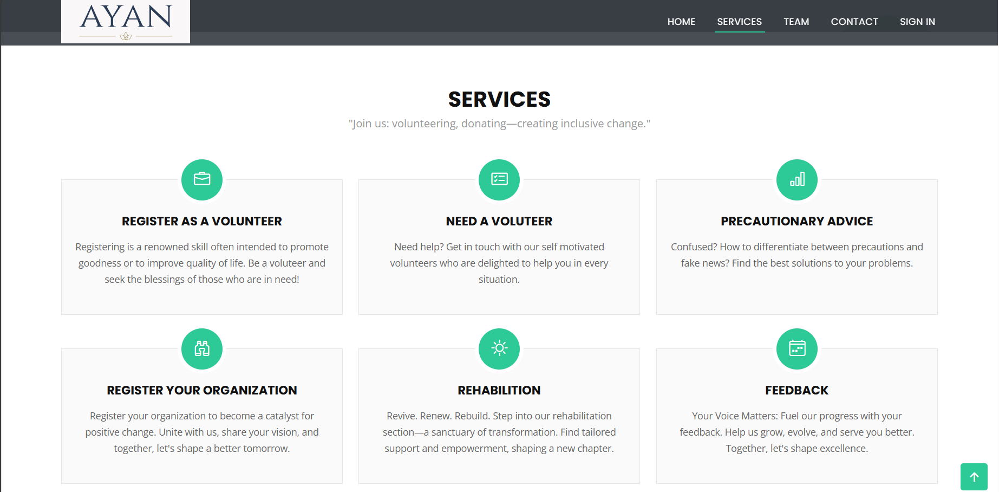

# Ayan - A Helping Hand

## Project Overview
Ayan - A Helping Hand is a comprehensive disaster relief ecosystem designed to provide support during critical periods. This platform encompasses various services such as peer-to-peer volunteer support, donation payment methods, vendor services, local medical aid, rehabilitation, and offline location sharing. It aims to connect community members with essential services through an integrated communication system.



## Team Members
This project was developed by a team of four members:
- **Khushi Agnihotri**: Frontend Development
- **Ananya Verma**: Backend Development
- **Abhinav Singh**: IoT Integration
- **Akshat Verma**: Blockchain Implementation

## Features
- **Peer-to-Peer Volunteer Support**: Connects volunteers with those in need.
- **Donation Payment Methods**: Facilitates secure and easy donations.
- **Vendor Services**: Provides a platform for vendors to offer essential services.
- **Local Medical Aid**: Connects users with nearby medical services.
- **Rehabilitation Services**: Assists in post-disaster rehabilitation efforts.
- **Offline Location Sharing**: Enables sharing of location information without internet access.
- **Comprehensive Communication System**: Integrates communication channels to ensure connectivity during critical periods.



## Technologies Used
- **Frontend**: HTML, CSS, JavaScript
- **Backend**: PHP
- **IoT**: Implemented by Abhinav Singh
- **Blockchain**: Implemented by Akshat Verma

## Installation
1. Clone the repository:
    ```bash
    git clone https://github.com/yourusername/ayan-helping-hand.git
    ```
2. Navigate to the project directory:
    ```bash
    cd ayan-helping-hand
    ```
3. Set up the backend:
    - Ensure you have a local server like XAMPP or WAMP installed.
    - Move the project files to the server's root directory (e.g., `htdocs` for XAMPP).
    - Start the Apache and MySQL services.
    - Import the provided SQL database file into your MySQL server.
4. Open the project in your web browser:
    ```url
    http://localhost/ayan-helping-hand
    ```

## Usage
- Register as a volunteer or a person in need.
- Access various services through the dashboard.
- Use the donation system to contribute to disaster relief efforts.
- Communicate with other community members through the integrated messaging system.

## Contributing
We welcome contributions to improve this project. Please fork the repository and create a pull request with your changes.

## License
This project is licensed under the MIT License. See the [LICENSE](LICENSE) file for more details.

Thank you for using Ayan - A Helping Hand! Together, we can make a difference in times of disaster.
